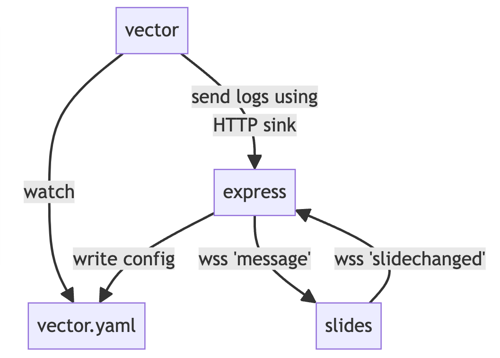

# "hands on" Vector Breizhcamp 2k24

Slides et code utilisé pour le "hands on" joué au Breizhcamp 2024. J'y présente au format 25min. Vector un nouveau venu dans le monde des pipelines d'observabilité.

Je pars du principe que vous avez vector et docker d'installé.

Lancer les différents éléments en parallèle.

```shell
# lancer le serveur node
cd server
npm install && node index.js

# lancer la prez reveal.js
cd slides
npm run start

# générer des logs
docker run --name generate_logs --rm \
    -v $PWD/vector/generate_logs.py:/tmp/generate_logs.py \
    -it python:slim python /tmp/generate_logs.py \
    --interval 2 --format apache

# lancer vector sur le fichier de conf en mode "watch
cd vector
vector -c vector.yaml -w
```

La conf vector est mise à jour au changement de certains slides/fragments.



## références

* j'ai récupéré le style terminal dans ce [codepen](https://codepen.io/robinselmer/pen/vJjbOZ) de robinselmer. 
* la plupart des captures ou images sont issues de la doc officielle de Vector: https://vector.dev
* étoile noire: https://www.stickpng.com/fr/img/nature/espace/univers/etoile-noire
* xwing: https://www.pngegg.com/en/png-cxvdm
* "crashed ship": https://www.pinterest.com/pin/star-wars-saturdayby-igor-tkacconcept-ships-x2f-20160109-1231antonis-karidis-on-artstationcomke--204491639311393573/

